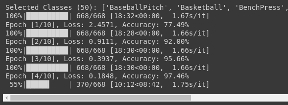

# Activity Recognition using MobileNetGRU



This project implements a human activity recognition system using a deep learning model based on MobileNetV2 and a GRU (Gated Recurrent Unit) layer.  The project consists of two main Python files: `train.py` (for model training) and `predict.py` (for activity prediction from video input).

## Project Structure

```
activity_recognition/
├── train.py          # Train the MobileNetGRU model.
├── predict.py        # Predict activity from video input (local or YouTube).
└── README.md         # This file.
```

## Dependencies

The project relies on several Python libraries.  Make sure you have them installed before running the scripts. You can install them using pip:

```bash
pip install torch torchvision torchaudio opencv-python numpy Pillow yt-dlp
```

## `train.py` - Model Training

This script trains the `MobileNetGRU` model on the UCF50 dataset.  It performs the following steps:

1. **Data Loading:** Loads video data from the UCF50 dataset.  The dataset must be located at `/content/UCF50/` (or adjust the path in the code).  It extracts a fixed number of frames from each video, applies transformations (resizing and converting to tensors), and creates data loaders for training and testing.

2. **Model Definition:** Defines the `MobileNetGRU` model architecture, combining MobileNetV2 for feature extraction and a GRU layer for temporal modeling. It utilizes pre-trained weights from `MobileNet_V2_Weights.DEFAULT` for improved performance.

3. **Training Loop:** Iterates through the training data, optimizing the model's parameters using the Adam optimizer and CrossEntropyLoss.  It evaluates the model's performance on the test set after each epoch.

4. **Evaluation and Visualization:** Calculates and displays training loss and test accuracy curves.  Provides a classification report (precision, recall, F1-score, support) for each activity class.

5. **Model Saving:** Saves the trained model weights to `"gru_model_complete.pth"`.

**To run the training script:**

```bash
python train.py
```

**Note:** Training on the UCF50 dataset requires significant computational resources.  Consider using a GPU for faster training.


## `predict.py` - Activity Prediction

This script uses the pre-trained `MobileNetGRU` model to predict human activities from video input. It can handle both local video files and YouTube URLs.

1. **Input Handling:** Takes a video path (local or YouTube URL) as input. Downloads YouTube videos temporarily using `yt_dlp`.

2. **Frame Extraction:** Extracts a specified number of evenly spaced frames from the video using OpenCV (`cv2`).

3. **Preprocessing:**  Resizes frames to 224x224 and converts them to PyTorch tensors.

4. **Model Loading:** Loads the pre-trained `MobileNetGRU` model from `"weights_dict_epoch_7.pth"` (**Note:** This should ideally be changed to load from the file saved by `train.py`).

5. **Prediction:** Feeds the preprocessed frames to the loaded model and prints the predicted activity class.

**To run the prediction script:**

```bash
python predict.py --video <video_path_or_youtube_url>
```

Replace `<video_path_or_youtube_url>` with the path to your local video file or a YouTube URL.  For example:

```bash
python predict.py --video my_video.mp4
python predict.py --video https://www.youtube.com/watch?v=VIDEO_ID
```

You may need to install `argparse` if you get an error using the command-line arguments. Use `pip install argparse`.


## Improvements and Future Work

* **Unified Frame Extraction:** Refactor frame extraction logic into a reusable module for both `train.py` and `predict.py`.
* **Robust Error Handling:** Implement comprehensive error handling for file I/O, network requests, and model loading.
* **Configuration File:** Use a configuration file (e.g., YAML or JSON) to manage parameters and paths.
* **Class Name Management:** Import `class_names` from `train.py` into `predict.py` to avoid duplication and maintain consistency.
* **Hyperparameter Tuning:** Explore different hyperparameters to optimize model performance.
* **Model Deployment:** Deploy the model for real-time activity recognition.


This README provides a comprehensive overview of the activity recognition project.  Further details can be found within the code itself.


---
Generated with ❤️ using [GitDocs](https://github.com/mikhail-ram/gitdocs).
